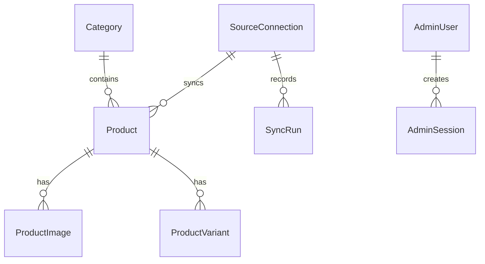

# Database Documentation

## Schema
- **SourceConnection**: Represents a connection to an external store (Shopify/WooCommerce).
- **Product**: The main product entity, storing both manual and synced data.
- **Category**: Represents a product category.
- **ProductImage**: Stores image URLs for products.
- **ProductVariant**: Stores product variants (sizes, colors, etc.).
- **SyncRun**: Records the history and outcome of import sync runs.
- **CatalogConfig**: Stores global settings like business name, WhatsApp number, and active template.
- **AdminUser**: Represents an administrator account.
- **AdminSession**: Tracks active administrator sessions.
- **LoginThrottle**: Prevents brute-force login attacks.

## Key Relationships

## Design Decisions
- **Decimal**: Prices use Decimal(12, 2) to prevent floating-point precision errors.
- **Cascade Behavior**: Deleting a product cascades to images and variants.
- **Source Identity**: Products have unique constraints on sourceConnectionId and sourceProductId to prevent duplicates.
